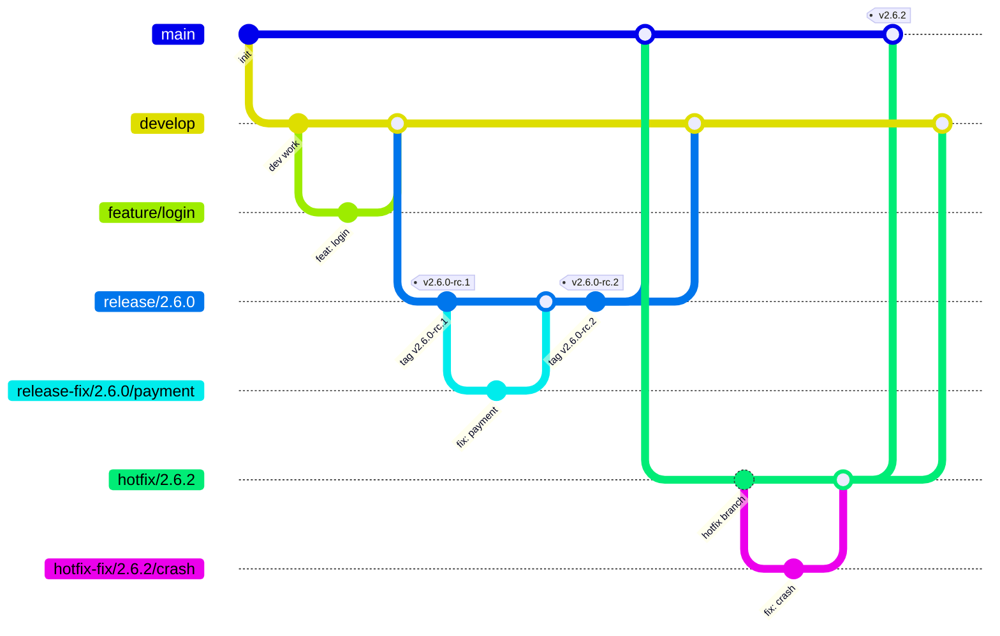
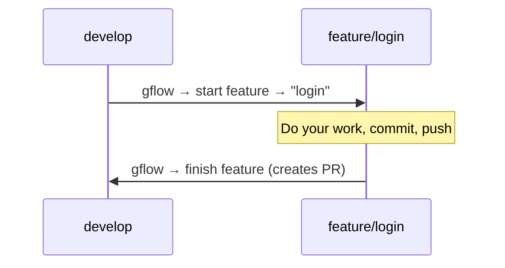
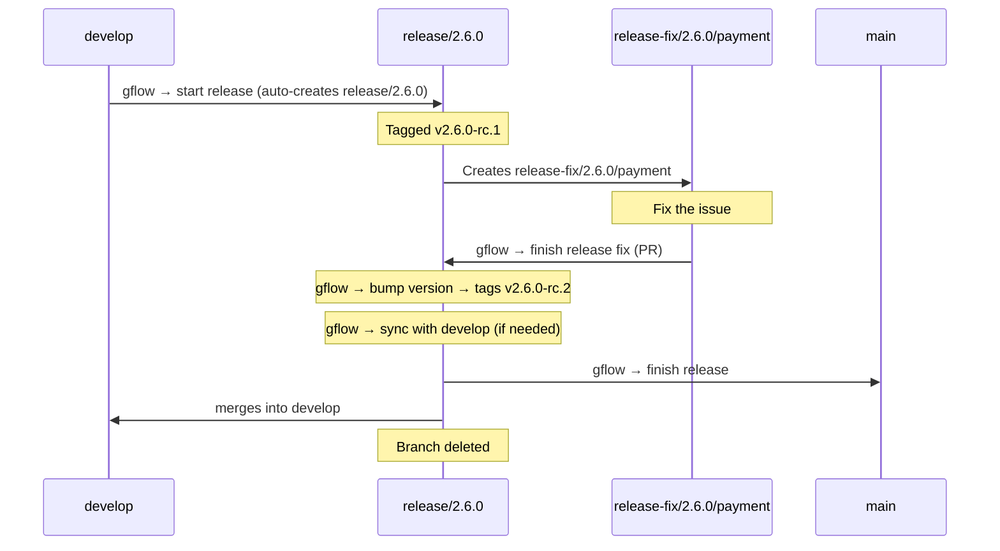
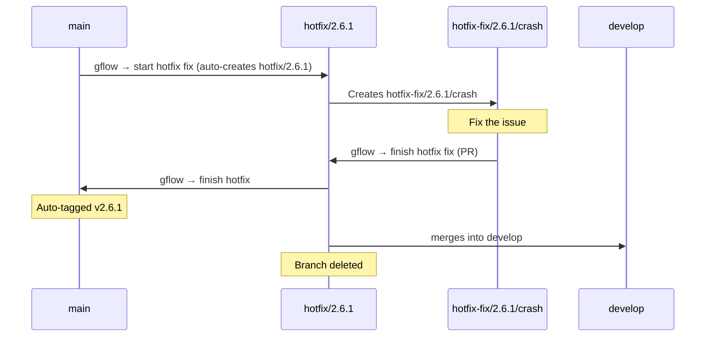
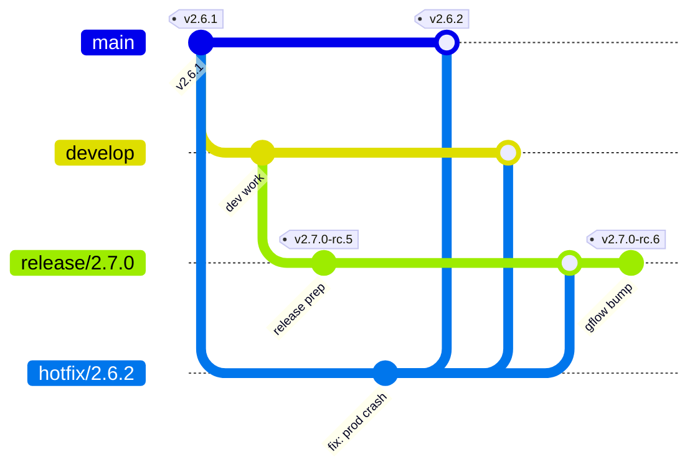
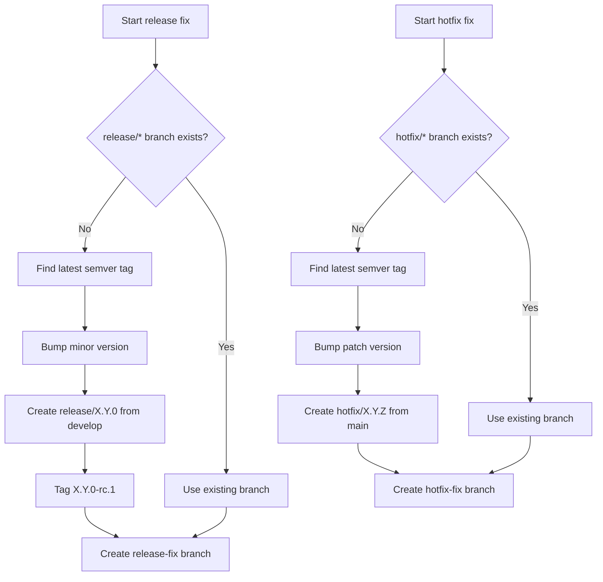
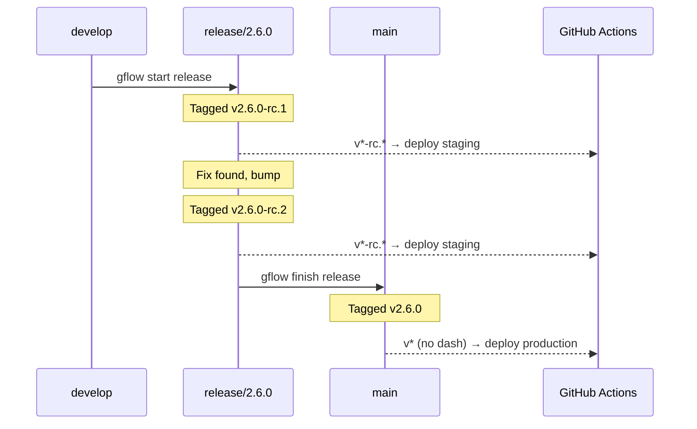

# gflow — a customized gitflow workflow CLI

A cross-platform CLI tool that implements a customized gitflow workflow. It detects your current git branch, presents context-appropriate options, and handles all the branching, merging, tagging, and PR creation for you.

## Installation

### Homebrew (macOS)

```bash
brew tap jopmiddelkamp/tap
brew install gflow
```

### Chocolatey (Windows)

```powershell
choco install gflow
```

### Pre-built binaries

Download the latest release from the [GitHub Releases](https://github.com/jopmiddelkamp/gflow/releases) page.

### From source

```bash
cargo install --path .
```

### Requirements

- [git](https://git-scm.com/)
- For GitHub repos: [gh](https://cli.github.com/) (GitHub CLI, authenticated via `gh auth login`)
- For Azure DevOps repos: [az](https://learn.microsoft.com/cli/azure/) (Azure CLI) with the `azure-devops` extension (`az extension add --name azure-devops`), authenticated via `az login` or a PAT via `az devops login`

### Hosting provider

gflow auto-detects the hosting provider from the `origin` remote URL: `dev.azure.com` and `*.visualstudio.com` remotes use Azure DevOps (org/project/repo are parsed from the URL), everything else uses GitHub. Only the CLI of the detected provider needs to be installed.

To override detection (e.g. a GitHub Enterprise domain), set:

```bash
git config gflow.hosting.provider github   # or: devops (requires an Azure DevOps origin URL)
```

### Mainline branch (`main` or `master`)

gflow works with either name. On its first run in a repository it detects which
one you use — `main` if that branch exists locally or on the remote, otherwise
`master` — saves the answer to your **repository's** config, and says so:

```
Detected mainline branch 'master' (saved to gflow.branch.main).
```

Every later run just reads the setting. To set or change it yourself:

```bash
git config gflow.branch.main master   # or: main
```

The key is repo-local on purpose: the mainline is a property of the repository,
not of the developer (the opposite of the worktree settings, which are personal
preference and therefore global by default). Only `main` and `master` are
supported; any other value is rejected with a message naming the fix.

## Branch Model

gflow manages two permanent branches and several short-lived branch types:



### Branch Types

| Branch | Created from | Merges into | Purpose |
|--------|-------------|-------------|---------|
| `main` / `master` | — | — | Production code |
| `develop` | — | — | Integration branch |
| `feature/{name}` | `develop` | `develop` (PR) | New functionality |
| `fix/{name}` | `develop` | `develop` (PR) | Bug fixes |
| `chore/{name}` | `develop` | `develop` (PR) | Maintenance & tooling |
| `docs/{name}` | `develop` | `develop` (PR) | Documentation |
| `refactor/{name}` | `develop` | `develop` (PR) | Code restructuring |
| `release/{major}.{minor}.{patch}` | `develop` | `main` + `develop` | Release preparation |
| `release-fix/{v}/{name}` | `release/{v}` | `release/{v}` (PR) | Fixes during release |
| `release-chore/{v}/set-version` | `release/{v}` | `release/{v}` (PR) | gflow-created: version-script commit that can't land directly ([Landing Modes](#landing-modes--version-script)) |
| `hotfix/{major}.{minor}.{patch}` | `main` | `main` + `develop` + open `release/*` | Urgent production fix |
| `hotfix-fix/{v}/{name}` | `hotfix/{v}` | `hotfix/{v}` (PR) | Fixes during hotfix |

## How It Works

Run `gflow` in any git repository. The tool detects your current branch and shows the appropriate menu.

### Initialising a repository

gflow keeps its repo-wide policy in a committed `.gflow/config`. A repository
without that file is **not initialised**: interactive `gflow` offers a
three-question setup (landing mode, whether to keep release branches, bump
strategy) and writes the file; subcommands refuse with `run 'gflow init'`.
Run `gflow init` yourself at any time, then commit `.gflow/config` so every
clone and CI job shares the same policy.

```bash
gflow init    # one-time per repository; then commit .gflow/config
```

### Uncommitted Changes

When you run `gflow start` with uncommitted changes (staged, unstaged, or untracked files), gflow automatically stashes your changes, creates the new branch, and restores them on the new branch. No flags or prompts needed — your work-in-progress follows you.

If restoring changes causes conflicts with the target branch, gflow leaves the conflicts for you to resolve manually (the stash is preserved as a safety net).

Finish commands (`gflow finish`, `gflow bump`, `gflow sync`) still require a clean working tree.

### On `develop`

```
? What would you like to do?
> start feature
  start fix
  start chore
  start docs
  start refactor
  start release
```

### On the mainline (`main` / `master`)

```
? What would you like to do?
> start hotfix fix
```

### On a work branch (feature, fix, chore, docs, refactor)

```
? What would you like to do?
> finish {type}
  start feature
  start fix
  start chore
  start docs
  start refactor
```

Selecting finish creates a PR back to the base branch. You can also start a new branch from the current branch or from `develop`.

### On `release/{v}`

```
? What would you like to do?
> finish release
  start release fix
  bump version
  sync with develop
```

### On `release-fix/{v}/{name}`

```
? What would you like to do?
> finish release fix
```

### On `hotfix/{v}`

```
? What would you like to do?
> finish hotfix
  start hotfix fix
```

### On `hotfix-fix/{v}/{name}`

```
? What would you like to do?
> finish hotfix fix
```

## Non-Interactive CLI (for AI tools & scripts)

All commands can be invoked directly via subcommands, bypassing the interactive menu:

### Start commands

```bash
gflow start feature --name <name> [--base <branch>] [--no-checkout] [--no-worktree]
gflow start fix --name <name> [--base <branch>] [--no-checkout] [--no-worktree]
gflow start chore --name <name> [--base <branch>] [--no-checkout] [--no-worktree]
gflow start docs --name <name> [--base <branch>] [--no-checkout] [--no-worktree]
gflow start refactor --name <name> [--base <branch>] [--no-checkout] [--no-worktree]
gflow start release [--major | --minor] [--no-worktree]
gflow start release-fix --name <name> [--no-checkout] [--no-worktree]    # must be on a release branch
gflow start hotfix-fix --name <name> [--no-checkout] [--no-worktree]     # must be on the mainline or a hotfix branch
```

`--base` defaults to `develop` when omitted.

`--major` / `--minor` on `start release` skips the interactive prompt and forces the bump level. Useful for scripts and AI agents.

`--no-checkout` creates and pushes the branch without switching to it. You stay on your current branch. Designed for [git worktree](https://git-scm.com/docs/git-worktree) workflows. Not available for `start release`.

`--no-worktree` skips the optional [worktree flow](#worktree-integration) for a single command when `worktree=true` is set. No effect otherwise.

### Finish

```bash
gflow finish [--breaking | --breaking=false] [--base <branch>] [--accept-merge-type]
gflow finish --abort   # discard an in-progress release/hotfix finish
```

Infers the action from the current branch type (e.g., creates PR on work branches, merges + tags on release/hotfix branches).

Every PR gflow creates or re-surfaces — work and fix PRs, protected-mode
landing PRs, version PRs — also opens in your default browser right after its
URL is printed. When no browser can open (headless CI, no `xdg-open`), gflow
prints a warning and carries on; the PR itself is unaffected.

Protected-mode landing PRs (the merges gflow opens when finishing — hotfix or
release into `main`, `develop`, or an open `release/*`) get an **empty
description**: their title says everything, so the repository's own PR
template never decorates them. A `gflow-release.md` / `gflow-hotfix.md` (or
`gflow-default.md`) in `.github/pr-templates/` still applies when you created
one on purpose.

On feature, fix, and refactor branches, `gflow finish` asks whether the work contains breaking changes. Pass `--breaking` (true) or `--breaking=false` to skip the prompt in non-interactive contexts. The flag is honored on any work branch type.

On work branches, the PR target is normally detected from the branch topology: when exactly one candidate parent is found it is used directly, and only when several candidates exist does a selection menu appear. Candidates are `develop` plus the work branches your branch could have come from, ranked nearest-first; work branches that were started *from* your branch are excluded, while `develop` is always offered no matter how far ahead of you it has moved. Pass `--base <branch>` to set the target explicitly and skip detection and the menu entirely — combined with `--breaking`, this makes `gflow finish` fully scriptable without a TTY (CI, AI agents). The branch must exist on origin — PRs are created on the hosting platform, so a local-only branch is rejected (push or fetch it first) — and must differ from the branch being finished. `--base` is only valid on work branches; release, hotfix, release-fix, and hotfix-fix finishes have a fixed target and reject it.

#### PR completion types

Every PR gflow opens must be completed with a specific button, and gflow prints
a hard-to-miss banner next to the PR URL saying which one:

- **Work and fix PRs** (feature/fix/chore/docs/refactor, `release-fix`,
  `hotfix-fix`, `release-chore`, version PRs) → **Squash**. One commit per
  change lands on the target.
- **Protected-mode landing PRs** (`finish/*` into `main`/`develop`/`release/*`)
  → **Merge commit**. The merge keeps history connected, which the finish
  flows rely on.

gflow cannot pre-select the button (GitHub has no API for it), so it **verifies
after the fact**: on the next run it reads the merge commit's parent count
(2 parents = merge commit, 1 = squash). A wrong completion **hard-stops the
flow** — nothing is cleaned up or tagged — and prints the undo steps:

- Wrongly **merged** work PR: revert (or reset) the merge on the target, run
  `git commit --amend --no-edit` on your branch (the new commit id lets a
  fresh PR open), then re-run `gflow finish`.
- Wrongly **squashed** landing PR: revert the PR on the hosting platform —
  a protected branch cannot be force-pushed back.

To accept the mistake and continue instead, re-run the same command with
`--accept-merge-type` (available on `finish` and `sync`). A rebase merge of a
single-commit PR is indistinguishable from a squash and passes the squash
check — the result is identical.

#### After the PR is merged

Re-running `gflow finish` on a work branch (or release-fix/hotfix-fix branch) whose PR has been **merged** completes the finish instead of opening a new PR: it deletes the remote branch (if the platform didn't already), deletes the local branch, and — when the branch lives in its own [worktree](#worktree-integration) — removes the worktree and tells you the editor window can be closed. Completion is detected from the hosting platform's PR state, so there is nothing to remember between runs.

Cleanup only happens when the local branch tip is exactly the commit the PR merged; if you committed more work after the merge, `gflow finish` says so and opens a fresh PR for the new commits instead. A PR that was closed without merging also leads to a new PR, never to cleanup. Outside a worktree, cleanup switches you back to the PR's target branch and fast-forwards it first.

#### Resuming after a merge conflict

`gflow finish` on **release** and **hotfix** branches is **idempotent**: if a merge into `main`, `develop`, or an open `release/*` branch conflicts, resolve the conflict in your editor and `git commit` the merge. A conflict usually leaves HEAD on the target branch (e.g. `develop`), so to continue you **switch back to the source branch and re-run `gflow finish`**:

```bash
git add . && git commit --no-edit   # complete the merge you just resolved
git switch hotfix/2.5.2             # back to the branch that started the finish
gflow finish                        # resumes; already-done steps are skipped
```

Steps that already completed (merges, tags, pushes, branch deletion) are detected from git state and skipped — the flow continues from the first incomplete step. The conflict message names the exact branch to switch back to.

**Resume is branch-scoped.** Each in-progress finish is tracked in its own file under `.git/gflow-finish/` (e.g. `hotfix-2.5.2.state`), keyed by the source branch. gflow only resumes when you are standing on that source branch — from `develop`, `main`, or any `feature/*` branch it behaves normally, so a stalled finish never blocks other work. Two finishes (e.g. a release and a hotfix) can be in progress at once without colliding. Use `gflow finish --abort` from the source branch to discard its in-progress state and start fresh.

#### PR templates

When `gflow finish` opens a PR, it picks the body template by branch type. Place templates in `.github/pr-templates/` named `gflow-<key>.md`. Resolution is most-specific first:

1. **Branch-specific** — `gflow-<type>.md` (e.g. `gflow-release-fix.md`)
2. **Group** — the fix family (`fix`, `release-fix`, `hotfix-fix`) shares `gflow-fix.md`; every other type's group equals its own name
3. **Default** — `gflow-default.md`
4. **Git default** — the repo's own default template, else an empty body. On GitHub: `.github/PULL_REQUEST_TEMPLATE.md` and the other paths `gh` recognizes. On Azure DevOps: `.azuredevops/pull_request_template.md` and the other ADO default paths.

| File | Applies to |
|------|-----------|
| `gflow-feature.md` | `feature/*` |
| `gflow-fix.md` | the fix family — `fix/*`, `release-fix/*`, `hotfix-fix/*` (unless overridden below) |
| `gflow-release-fix.md` | only `release-fix/*` (overrides `gflow-fix.md`) |
| `gflow-hotfix-fix.md` | only `hotfix-fix/*` (overrides `gflow-fix.md`) |
| `gflow-chore.md` / `gflow-docs.md` / `gflow-refactor.md` | `chore/*` / `docs/*` / `refactor/*` |
| `gflow-default.md` | any PR with no more specific match |

The feature is opt-in: with no `.github/pr-templates/` directory, gflow falls back to the existing git default behavior unchanged. gflow templates live in `.github/pr-templates/` on every hosting provider, including Azure DevOps.

### Release-only commands

```bash
gflow bump    # bump patch version
gflow sync    # sync release into develop  [--accept-merge-type]
```

Both require being on a release branch.

## Worktree integration

Optionally, every new branch can be created in its own [git worktree](https://git-scm.com/docs/git-worktree) and opened in your editor, so each piece of work lives in a separate directory instead of switching the current checkout. It's off by default and uses native `git worktree` — no extra tools required.

### Enable

The quickest way is the built-in setup command — no need to remember any keys:

```bash
gflow worktree              # interactive setup: enable, pick an editor, choose a location
```

Or set options directly (handy for scripts and dotfiles):

```bash
gflow worktree enable                 # turn the flow on
gflow worktree editor cursor          # code (default) | cursor | windsurf | zed | pycharm | none | any command
gflow worktree path ~/worktrees       # where worktree folders go (default: the repo's parent)
gflow worktree status                 # show the current settings (all layers merged)
gflow worktree disable                # turn it off

gflow worktree enable --repo          # ... in this repository's committed config
gflow worktree enable --local         # ... in this repository, for you only (not committed)
```

These write to `~/.gflow/config` by default (per-developer, all repositories). Two flags aim
them elsewhere: `--repo` writes the repository's committed `<repo>/.gflow/config`, and `--local`
writes `<repo>/.gflow/config.local`, which is yours alone and never committed. All three are
plain `key=value` files you can also edit by hand — see
[Configuration layers](#configuration-layers):

| Key | Default | Meaning |
|-----|---------|---------|
| `worktree` | `false` | Turn the worktree flow on |
| `editor` | `code` | Command to open the worktree (`<editor> <path>`). Use `none` to skip opening |
| `path` | _(unset)_ | Directory to place worktree folders in (`~` is expanded). Defaults to the repo's parent directory |

> Upgrading from 4.0.x: the old `gflow.worktree.*` git config keys move into these files
> automatically on the first run — global keys to `~/.gflow/config`, `--local` keys to that
> repository's `.gflow/config.local`. Local git config was never committed, so it stays
> uncommitted. Nothing to do by hand, and nothing appears in `git status`.

One other key lives outside this family and is **repo-local**, because the
mainline is a property of the repository rather than a per-developer preference:

| Key | Default | Meaning |
|-----|---------|---------|
| `gflow.branch.main` | detected on first use | The repo's mainline branch — `main` or `master`. See [Mainline branch](#mainline-branch-main-or-master) |

The editor accepts any command whose CLI opens a folder as `<command> <path>` — VS Code (`code`),
Cursor (`cursor`), Windsurf (`windsurf`), Zed (`zed`), and JetBrains launchers
(`idea` / `pycharm` / `webstorm` / …) all work once their shell command is on your `PATH`.

### What it does

When enabled, `gflow start feature/fix/chore/docs/refactor` (and `release-fix` / `hotfix-fix`) will:

1. Create and push the branch **without** switching your current checkout.
2. Add a git worktree for it.
3. Open that folder in your editor (unless `editor = none`). An editor that isn't installed is a warning, not a failure — the worktree is still ready.

Pass `--no-worktree` to skip the flow for a single command.

`start release` is included, with one difference: the release branch is created
and tagged in your current checkout (the version script must run on a
checked-out branch), then your checkout returns to `develop` and the release
opens in its own worktree. Re-running `start release` while a worktree already
holds the release just prints its path.

`start hotfix-fix` also covers the `hotfix/{v}` container branch it resolves or
creates: the container gets its own worktree too — that is where `gflow finish`
runs later — opened before the fix branch's worktree, so the fix keeps editor
focus. A hotfix already held by a worktree just prints its path.

### Setup commands (`worktrees.json`)

With the worktree flow enabled, gflow looks for the repo's setup commands
after creating a worktree and runs them **before opening the editor** — the
same files Cursor and [worktree-cli](https://github.com/johnlindquist/worktree-cli)
use: `.cursor/worktrees.json` (a JSON array of commands) or `worktrees.json`
at the repo root (`{"setup-worktree": [...]}`); the first non-empty one wins,
no file means nothing runs. Each entry is a shell command run inside the new
worktree with `$ROOT_WORKTREE_PATH` pointing at your main checkout; a failing
command is reported and the rest still run, and the start never fails because
of a setup command. Nothing is asked — the file is repo content you committed,
so enabling worktrees is the opt-in, and with the flow disabled the file is not
read at all.

The file must be strict JSON — the same dialect `JSON.parse` accepts, so what
works here works for the other tools reading it. A file gflow cannot parse is
reported as a warning naming the file and the byte offset (a trailing comma is
called out as such), the setup commands are skipped, and the command you ran
carries on: a typo in `worktrees.json` never blocks gflow.

```json
{
  "setup-worktree": [
    "fvm use",
    "dart pub get",
    "cd tools/shuttel_lint && dart pub get"
  ]
}
```

As with `--no-checkout`, an active worktree flow relaxes the branch-type check for `release-fix` and `hotfix-fix` — the target release/hotfix branch is discovered automatically, so you can run them from any branch. Discovery is a fallback, not an override: standing on a `release/{v}` or `hotfix/{v}` branch means `release-fix`/`hotfix-fix` targets *that* branch, even inside a worktree. When gflow does have to discover, it takes the newest open version, never the first name in sort order.

### Naming & layout

Worktree folders are flat siblings of the repo (or live under `gflow.worktree.path`), each named `<repo-name>-<branch-with-slashes-as-dashes>` so the folder's own name tells you which repo and branch it is:

```
Projects/
├── gflow/                              # main checkout (stays on develop/master)
├── gflow-feature-login/                # worktree for feature/login
├── gflow-fix-auth-bug/                 # worktree for fix/auth-bug
└── gflow-release-fix-1.2.0-null-crash/ # worktree for release-fix/1.2.0/null-crash
```

### Repo content in a worktree

Wherever gflow runs — the main checkout or a linked worktree — it reads `.gflow/config`, the version script, and PR templates from **that** working tree, not the main one. A linked worktree can have a different branch checked out than the main tree, so this is what lets each worktree apply its own branch's mode, script, and templates instead of silently picking up whatever the main checkout happens to have.

### Finishing from a worktree

`gflow finish` on a release or hotfix branch can run from any worktree. For each
merge target (`main`, `develop`, open `release/*`) gflow asks git where that
branch is checked out. If another worktree holds it, the merge runs *in that
worktree* (`git -C <path> merge …`), and that tree must be clean — gflow refuses
and names the path otherwise, so it never merges over uncommitted work. If no
worktree holds the target, it is checked out in the current tree as before.
Cleanup follows the same rule: if the finish ends while still standing on the
release/hotfix branch and `main` is held by another worktree, gflow detaches
HEAD instead of checking `main` out, then deletes the branch.
When the finish runs inside the release/hotfix branch's own worktree and deletes
the branch, it removes that worktree too and tells you the editor window can be
closed. With `keep-release-branches=true` (or when gflow keeps the branch as a
safety guard) the worktree stays with it.

## Workflows

### Feature / Fix / Chore / Docs / Refactor

Simple workflow for day-to-day work:



### Release

Releases are tagged for deployment. Build agents auto-deploy based on tags.



#### Release commands

When starting a release, gflow scans commits since the last release for breaking changes and preselects major or minor accordingly. A commit is considered breaking if its title has `!` before the colon (e.g. `feat!: drop legacy API`, `refactor(auth)!: rewrite`), or if the body contains a line starting with `BREAKING CHANGE:` or `BREAKING-CHANGE:` (case-insensitive, per [Conventional Commits](https://www.conventionalcommits.org/)).

When finishing a feature, fix, or refactor branch, gflow asks whether the work contains breaking changes. If yes, the PR title gets a `!` suffix (e.g. `feat!: name`) so the signal carries into the commit history and gets picked up at the next release. For non-interactive use (scripts, CI, AI agents), pass `--breaking` (true) or `--breaking=false` to skip the prompt.

| Command | What it does |
|---------|-------------|
| **gflow bump** | Creates next RC tag (v2.6.0-rc.1 → v2.6.0-rc.2) — or the next patch tag (v2.6.0 → v2.6.1) under [`bump-strategy=patch`](#bump-strategy-rc-vs-patch) |
| **gflow sync** | Merges release changes into `develop` for fixes needed immediately |
| **gflow finish** | Creates clean production tag (v2.6.0), merges into `main` + `develop`, cleans up branch. Under `bump-strategy=patch` it only merges — the last bump tag is already final |

> **Staging-tag guard:** `gflow finish` on a release branch is rejected if HEAD has commits past the latest RC tag (or latest patch tag under `bump-strategy=patch`). Every commit merged to `main` must have been validated on staging via a tagged deploy. If the guard fires, run `gflow bump` to cut the next tag, wait for staging to pass, then `gflow finish`.

### Hotfix

For urgent production fixes:



#### Hotfix while a release is in flight

When a hotfix is finished and a `release/*` branch is open, gflow also propagates the fix into every open release branch (after `main` and `develop`, before cleanup). Without this, the upcoming release would ship a tree that was never validated on staging in its final form — staging deployed the release without the hotfix, and the release-into-main merge would produce a combined tree at production-tag time that no RC ever covered.



The hotfix lands on `main` (production-tagged `v2.6.2`), `develop`, *and* `release/2.7.0`. Because the release branch advances past its previous RC tag, `gflow finish` on the release will refuse to run until the operator runs `gflow bump` to cut `v2.7.0-rc.6` — at which point staging redeploys the *combined* code, so the eventual `v2.7.0` production tag is validated end-to-end. This is the same RC-head guard that protects every release path: production never deploys a tree that hasn't been validated on staging.

If the merge into a release branch conflicts, gflow surfaces the error and **keeps the hotfix branch alive** so you can resolve the conflict and retry. The merges into `main` and `develop` (and the production tag) have already completed at that point — the hotfix is shipped to production; only the propagation to the release branch is left to finish. Resolve the conflict, `git commit` the merge, and re-run `gflow finish` — already-done steps are skipped and the propagation resumes.

gflow already prevents the related "two open hotfixes" or "two open releases" cases at start-time: [`start.rs`](src/flows/start.rs) reuses an existing branch instead of creating a second one. The only concurrent state allowed is exactly this one — one release + one hotfix.

## Landing Modes & Version Script

Two related, opt-in features for teams whose `main`/`develop` reject direct pushes, or who keep the version number inside their own repo files (`Cargo.toml`, `package.json`, ...). The config file itself is required — see [Initialising a repository](#initialising-a-repository); with the defaults it selects, a repo behaves exactly as before.

### Configuration layers

gflow reads three files and merges them. Later layers override earlier ones, key by key —
a layer that stays silent about a key never undoes a lower one:

| Layer | File | Written by | Scope | Committed |
|-------|------|-----------|-------|-----------|
| 1 | `~/.gflow/config` | `gflow worktree …` | you, in every repository | no |
| 2 | `<repo>/.gflow/config` | `gflow worktree … --repo` | this repository, everyone who clones it | **yes** |
| 3 | `<repo>/.gflow/config.local` | `gflow worktree … --local` | you, in this repository | no (gitignored) |

So: your habits go in layer 1, the team's rules in layer 2, and your exceptions to
either in layer 3.

Layers 1 and 2 take every key. Layer 3 takes only the personal ones — `worktree`, `editor`,
`path`. `mode`, `keep-release-branches`, and `bump-strategy` are team decisions: a private
opt-out of `mode=protected` in a file nobody reviews would defeat the guarantee the committed
file exists to make. A team key found there is reported and ignored.

Layer 1 also makes `gflow init` optional for a throwaway repository: if `~/.gflow/config`
states a policy, a repo with no committed file of its own uses it rather than refusing.

gflow writes and maintains `<repo>/.gflow/.gitignore` itself, so layer 3 is never committed.
That file ignores itself too, so gflow's bookkeeping never shows up as untracked noise. Your
repository's own `.gitignore` is never touched.

### `.gflow/config`

A committed file, one `key=value` pair per line, `#` comments allowed, unknown keys ignored:

```
mode=protected
keep-release-branches=true
```

| Key | Values | Default | Meaning |
|-----|--------|---------|---------|
| `mode` | `free` \| `protected` | `free` | `free` is today's behavior: `finish`/`bump`/`sync` merge and push directly. `protected` lands every merge into `main`, `develop`, or an already-pushed `release/*` branch via a PR instead. |
| `keep-release-branches` | `true` \| `false` | `false` | When `true`, `finish` and `bump` stop deleting the `release/*`/`hotfix/*` branch when they're done with it. Work branches (`feature/*`, `fix/*`, ...) are never affected. |
| `bump-strategy` | `rc` \| `patch` | `rc` | How `bump` versions staged builds. `rc` is today's behavior: pre-release tags (`v2.6.0-rc.1`, `-rc.2`, …) with one clean tag at finish. `patch` increments the real patch version at every bump (`v2.6.0` → `v2.6.1` → …) — see [Bump strategy](#bump-strategy-rc-vs-patch). |

It also accepts `worktree`, `editor`, and `path` — the same keys `gflow worktree --repo` writes.
This file is committed, so a setting made here applies to everyone who clones the repository.
Keep machine-specific values (your editor, your worktree directory) in `~/.gflow/config`, or
in `<repo>/.gflow/config.local` when they apply to one repository only.

Any other value is a hard error naming the file, the key, and the accepted values. This is a **committed file, not git config**: these are team decisions, and a fresh clone must see the same policy everyone else does — git config is per-clone and would silently drift. (Same reasoning as the version script below.) What stays in git config is only what gflow detects and caches for itself: `gflow.branch.main` and `gflow.hosting.provider`.

### Bump strategy: `rc` vs `patch`

Some projects can't consume pre-release tags — every staged build needs a real, incrementing version written into the project's own version files. `bump-strategy=patch` serves those projects:

| Step | `rc` (default) | `patch` |
|------|----------------|---------|
| `gflow start release` | tags `v2.6.0-rc.1` | tags `v2.6.0` (clean) |
| `gflow bump` | tags `v2.6.0-rc.2`; version script gets `2.6.0` every time | increments the patch: tags `v2.6.1`; version script gets the **new** `2.6.1` |
| `gflow finish` | cuts the clean production tag `v2.6.0` | **merges only** — the last bump tag (e.g. `v2.6.2`) is already the final version (finish re-pushes it if origin is missing it) |

Everything else is identical: the staging guard still refuses `finish` when HEAD has commits past the latest tag (`gflow bump` is the remedy), protected mode still routes version-script commits through a PR and tags the PR's merge commit, and hotfixes work the same way. One patch-specific subtlety is handled for you: an open release branch's staging tags (`v2.6.0`, `v2.6.1`, …) are *not* production history, so a hotfix started while that release is in flight derives its version from the last shipped tag (e.g. `v2.5.4`), never from the release's in-flight numbers.

gflow writes `vX.Y.Z` tags. A tag without the `v` (`X.Y.Z`, e.g. cut by a pipeline) is read as the same version — for the latest-version lookup and for deciding that a release or hotfix has shipped.

One consequence to plan for: under `patch` every tag is a clean `vX.Y.Z` — there is no tag-shape distinction between staging and production, so CI must gate production on something other than the tag pattern (a branch, the merge to `main`, or a manual promotion step).

### Protected mode

Use `mode=protected` when `main`/`develop` require pull requests (branch protection, required reviews). In this mode:

- **gflow never merges a PR.** Every landing that would otherwise be a direct push instead opens (or reuses) a PR and prints its URL.
- **Every landing PR's head is a throwaway `finish/*` branch** cut from the source — `finish/release-1.2.0-into-main`, `finish/hotfix-1.1.1-into-release-1.2.0`, and so on. The release/hotfix branch itself is never a PR head, so nothing (a conflict resolution, the platform's auto-delete-head-branches setting) can ever touch it. gflow creates, refreshes, and deletes these branches itself; a landing that predates newer source commits is re-opened with a refreshed finish branch, so no commit can silently miss a target.
- `finish`, `bump`, and `sync` **exit 0** with the PR pending — nothing is left half-done, there's just a human step in between. Re-run the same command after the PR is merged; it continues from there.
- Landings happen **one PR per run**, in order (`main`, then `develop`, then — for hotfixes — each open `release/*` branch). Only the **last** landing deletes the source branch (and every `finish/*` branch, orphans included) — unless `keep-release-branches=true`, or its tip provably landed nowhere, in which case gflow keeps the branch and tells you how to remove it yourself.
- Progress is never stored on disk for a protected finish — there's nothing to resume, because it never merged locally. Each run re-derives what's landed from the hosting platform's PR state and from tags.
- **Landing PRs are born mergeable.** Before opening (or refreshing) a landing PR, gflow merges the target into the finish branch itself. A conflict — e.g. on the version file, see [Version-file merge-conflict papercut](#version-file-merge-conflict-papercut) — therefore surfaces immediately in your terminal, mid-run, and gflow announces that **your current worktree is now on the finish branch**, mid-merge. Resolve the conflicts right there, `git add . && git commit --no-edit`, and re-run — the re-run switches the worktree back to the source branch itself, pushes the resolution, and opens the PR conflict-free (`git merge --abort && git switch <source>` backs out instead). A PR that turns conflicted *later* because the target moved is healed the same way — just re-run. The release/hotfix branch is never touched by a resolution, and the finish branch is never rebased.
- **Upgrading with a landing in flight?** An open landing PR whose head is the release/hotfix branch itself (opened by an older gflow) is a hard error naming it: merge it and re-run, or close/abandon it and re-run — gflow then reopens it from a finish branch. Already-merged old-style legs are recognized as landed.
- That's different from deliberately adding *new*, unrelated work to a release branch after its `main` PR has merged — don't do that; the clean tag is already placed there. Ship further fixes as a hotfix instead. If you do, gflow says so rather than letting it pass unnoticed:

```
⚠ release/2.6.0 has 1 commit after the main landing: not in v2.6.0, and not reaching main.
  Release them as a hotfix if they must ship to production.
```

  Those commits still reach `develop` through the remaining landing, so nothing is lost — they just are not in this release.

A `gflow finish` loop on a release branch looks like this:

```
$ gflow finish
Copied PR title + URL to clipboard.

chore: merge release 2.6.0 into main
https://github.com/org/repo/pull/42

Waiting for a human to merge this PR.
Re-run 'gflow finish' to continue after the merge.

Conflicts later (main moved)? Just re-run — gflow merges `main` into `finish/release-2.6.0-into-main` in this worktree and stops there for you to resolve locally if needed.

  ... a human merges pull/42 on GitHub ...

$ gflow finish
Tagging: v2.6.0
Copied PR title + URL to clipboard.

chore: merge release 2.6.0 into develop
https://github.com/org/repo/pull/43

Waiting for a human to merge this PR.
Re-run 'gflow finish' to continue after the merge.

Conflicts later (develop moved)? Just re-run — gflow merges `develop` into `finish/release-2.6.0-into-develop` in this worktree and stops there for you to resolve locally if needed.

  ... a human merges pull/43 ...

$ gflow finish
Cleaning up release branch...
✔ Release 2.6.0 complete.
```

The title + URL pair is printed bare (bold title in a terminal, no prefixes) and copied to your clipboard, so pasting the PR into Slack is select-copy-paste — or just paste. On a machine without a clipboard tool the copy is silently skipped; the block is always printed. The same block is printed for work-branch and version PRs. Styling degrades automatically: bold is dropped when output is piped, when [`NO_COLOR`](https://no-color.org/) is set, or when `TERM=dumb`.

If cleanup finds commits on the branch that never reached any of the landed PRs — e.g. something was pushed to it directly after everything else landed — it keeps the branch instead of deleting it:

```
⚠ Keeping release/2.6.0: its tip is not part of any landed pull request, so deleting it could lose commits.
  Review it, then delete it yourself: git push origin --delete release/2.6.0
```

Hotfix branches print the same warning, naming the hotfix branch instead.

`gflow sync` behaves the same way on a release branch ("Re-run 'gflow sync' after the merge."). `gflow bump` may also defer its RC tag — see below.

### Version script

An opt-in repo file that lets gflow write the tag-derived version into your own source files at the moments the version changes, instead of you doing it by hand.

- **Path**: `.gflow/set-version.sh` (macOS/Linux) or `.gflow/set-version.cmd` (Windows) — picked by platform. Both files present is fine; only the *other* platform's file present (yours missing) is an error naming both paths. Neither present → the feature is off.
- **Contract**: gflow runs the script with `argv[1]` set to the clean `X.Y.Z` version (never a `-rc.N` form) and the current working directory set to the repo root.
- **Clean tree required**: gflow refuses to run the script on a dirty working tree, so a version commit never sweeps up unrelated local changes.
- **No-op is a no-op**: if the script leaves the tree unchanged, gflow makes no commit. If it changes files, gflow stages everything (`git add -A`) and commits `chore: set version {X.Y.Z}`.
- **The four moments it runs**: cutting a new release branch (version `X.Y.0`); bumping `develop` to the next dev version right after (warn-and-continue — a failure here doesn't undo the release; gflow tells you to update develop by hand); `gflow bump` on a release branch (`X.Y.0`); creating a new hotfix branch (`X.Y.Z`). Reusing an *existing* release/hotfix branch never re-runs the script.

A script gflow finds but can't run — most often because it's missing its executable bit — names the fix instead of a bare OS error:

```
Version script .gflow/set-version.sh could not be run: Permission denied (os error 13)
Make it executable: chmod +x .gflow/set-version.sh && git update-index --chmod=+x .gflow/set-version.sh, then re-run the command.
```

`git update-index --chmod=+x` is there because git tracks the executable bit itself — a local `chmod +x` alone doesn't survive a fresh clone. This differs from the platform-mismatch error above in *when* it can fire: platform mismatch is resolved eagerly, once, at the start of every command, so it fires no matter what you run; a not-executable script is only ever spawned by the commands that actually run it (cutting a release/hotfix branch, `gflow bump`) — that asymmetry can be surprising the first time you hit it.

#### `chore/set-version-*` and `release-chore/*/set-version` branches

In protected mode, a version commit that can't land directly goes out as its own PR from a branch gflow creates:

- `chore/set-version-X.Y.Z` — the develop version bump that follows a release cut.
- `release-chore/X.Y.0/set-version` — a version bump needed on an already-pushed release branch (during `gflow bump`).

**gflow creates and manages these — merge the PR, don't commit to them yourself.** If a human needs to intervene on a `release-chore/*` branch, it finishes exactly like a `release-fix` branch (`gflow finish` from it opens/updates a PR into its release branch); it has no `--base` flag, same as `release-fix`/`hotfix-fix`.

`gflow bump` deletes the `release-chore/*/set-version` branch itself the next time it revisits it, but nothing ever revisits `chore/set-version-*` after its PR merges, so it stays on the remote. Enable your hosting platform's automatic head-branch deletion (GitHub: "Automatically delete head branches"; Azure DevOps: the branch policy's auto-complete deletion option) to avoid the buildup, or delete it by hand.

#### Deferred RC tags

gflow never tags a commit that isn't yet on the branch being tagged. When `gflow bump` in protected mode needs a version-script commit on an already-pushed release branch, it opens the `release-chore/.../set-version` PR and defers the tag:

```
Copied PR title + URL to clipboard.

chore: set version 2.6.0
https://github.com/org/repo/pull/44

The RC tag is deferred until this PR merges. After it merges, re-run 'gflow bump' to cut the tag.
```

Re-running `gflow bump` after that PR merges tags the **PR's merge commit** directly — it does not re-run the script. A script whose output depends on repo history (e.g. a build number) would otherwise produce a different diff on every re-run; tagging the merge commit is what makes the RC converge to one tag instead of drifting forever.

#### Version-file merge-conflict papercut

Because `develop` and an open hotfix or release branch can carry different versions in their tracked files, merging one into the other can conflict on the version line — e.g. a hotfix's `1.2.1` against develop's already-bumped `1.3.0`, or a major release's `2.0.0` merging back into `develop`. Free mode surfaces this as an ordinary resumable merge conflict (resolve it, `git commit`, re-run `gflow finish`); protected mode surfaces it while merging the target into the `finish/*` branch — resolve it there mid-run, commit, and re-run. gflow does not auto-resolve version-file conflicts — it has no way to know which lines the script owns.

#### Hotfix branches created without checkout

`gflow start hotfix-fix --no-checkout` (or an active [worktree](#worktree-integration) flow) creates the hotfix branch without switching to it, so gflow cannot safely commit version files there — HEAD stays on your current branch. gflow skips the script and warns instead of guessing:

```
⚠ Version script not run: hotfix/1.2.1 was created without checkout, so gflow cannot commit version files there.
  Recover manually: git switch hotfix/1.2.1, run set-version.sh 1.2.1, commit, and push.
```

## Version Resolution

When starting a release-fix or hotfix-fix, gflow automatically resolves the integration branch:



## Commit Convention

All commits and PR titles generated by gflow follow [Conventional Commits](https://www.conventionalcommits.org/):

| Branch type | PR title format |
|------------|----------------|
| `feature/{name}` | `feat: {name}` |
| `fix/{name}` | `fix: {name}` |
| `chore/{name}` | `chore: {name}` |
| `docs/{name}` | `docs: {name}` |
| `refactor/{name}` | `refactor: {name}` |
| `release-fix/{v}/{name}` | `fix: {name}` |
| `hotfix-fix/{v}/{name}` | `fix: {name}` |

Dashes in the branch name are converted to spaces in the PR title (e.g. `feature/foo-bar` → `feat: foo bar`, `hotfix-fix/2.1.0/null-crash` → `fix: null crash`), keeping the squash-merged history readable.

Merge commits and tags also follow the convention:
- `chore: create release branch 2.6.0`
- `chore: bump version to v2.6.0-rc.2`
- `chore: release 2.6.0` (tag message for finish release)
- `chore: merge release 2.6.0 into main`
- `chore: merge release 2.6.0 into develop`
- `chore: sync release 2.6.0 with develop`
- `chore: merge hotfix 2.5.4 into main`
- `chore: hotfix 2.5.4` (tag message)
- `chore: merge hotfix 2.5.4 into develop`
- `chore: merge hotfix 2.5.4 into release/2.6.0` (when a release branch is open)
- `chore: set version 2.6.0` (version-script commit — see [Landing Modes & Version Script](#landing-modes--version-script))

## CI Integration

gflow uses **SemVer pre-release tags** to let CI systems distinguish staging from production deployments:

- **RC tags** (`v1.2.0-rc.1`, `v1.2.0-rc.2`) → staging/test deployments
- **Clean tags** (`v1.2.0`) → production deployments

This follows the convention used by Kubernetes, React, Node.js, Docker, and .NET.

### Tag Lifecycle



### GitHub Actions Setup

#### Staging (RC tags)

```yaml
name: Deploy Staging
on:
  push:
    tags: ['v*-rc.*']
jobs:
  deploy:
    runs-on: ubuntu-latest
    steps:
      - uses: actions/checkout@v4
      - run: echo "Deploying ${{ github.ref_name }} to staging"
```

#### Production (clean tags)

```yaml
name: Deploy Production
on:
  push:
    tags: ['v*']
jobs:
  deploy:
    if: "!contains(github.ref_name, '-')"
    runs-on: ubuntu-latest
    steps:
      - uses: actions/checkout@v4
      - run: echo "Deploying ${{ github.ref_name }} to production"
```

> **Why the `if` condition?** GitHub Actions tag patterns cannot exclude — `v*` matches both `v1.2.0` and `v1.2.0-rc.1`. The `if: "!contains(github.ref_name, '-')"` condition skips the job when the tag contains a hyphen (all RC tags do). The staging workflow doesn't need this because `v*-rc.*` only matches RC tags.

### Mobile Apps (Flutter, React Native)

Apple's App Store rejects version strings with hyphens — `CFBundleShortVersionString` only accepts `X.Y.Z` format. The RC tag is a **CI signal**, not the app version.

Your CI pipeline extracts the clean version from the tag and sets the build number separately:

```yaml
name: Deploy Staging
on:
  push:
    tags: ['v*-rc.*']
jobs:
  deploy:
    runs-on: ubuntu-latest
    steps:
      - uses: actions/checkout@v4
      - name: Extract version from tag
        run: |
          # Tag: "v1.2.0-rc.2" → version: "1.2.0"
          VERSION=$(echo "${{ github.ref_name }}" | sed 's/^v//' | sed 's/-.*//')
          echo "VERSION=$VERSION" >> $GITHUB_ENV
      - name: Build & deploy to TestFlight
        run: |
          flutter build ios \
            --build-name=$VERSION \
            --build-number=${{ github.run_number }}
          # TestFlight shows: "1.2.0 (47)"
```

**Traceability:** When a tester reports "bug on 1.2.0 (47)", check CI run #47 → triggered by tag `v1.2.0-rc.2` → `git show v1.2.0-rc.2` → exact commit.

## Architecture

```
src/
├── main.rs              — Composition root: builds adapters, preflight, hands off to lifecycle
├── lib.rs               — Library root, re-exports all modules
├── action.rs            — Action enum: the single currency both interfaces resolve into
├── cli.rs               — CLI subcommands (clap); resolves to Action
├── lifecycle.rs         — Resume lookup, stash/state ordering contract, dispatch
├── mainline.rs          — Resolves the repo's mainline branch (main vs master)
├── git/
│   ├── mod.rs           — Git trait, GitCli adapter, CommandRunner port
│   └── branch.rs        — Branch type detection and parsing
├── hosting/
│   ├── mod.rs           — HostingPlatform trait + CliRunner port
│   ├── detect.rs        — Provider detection from the origin remote URL
│   ├── github.rs        — GitHub implementation via gh CLI
│   └── devops.rs        — Azure DevOps implementation via az CLI
├── flows/
│   ├── start.rs         — Start work/release-fix/hotfix-fix
│   ├── finish_work.rs   — PR creation for work branches
│   ├── finish_release.rs — Bump, sync, finish release (idempotent)
│   └── finish_hotfix.rs — Finish hotfix with auto-tag, propagate to open releases (idempotent)
├── state.rs             — Persisted finish state for conflict recovery
├── repo_config.rs       — The config layer stack (~/.gflow/config, <repo>/.gflow/config,
│                         <repo>/.gflow/config.local), its key=value format, and the
│                         4.0.x git-config migration
├── version_script.rs    — Discovery + execution port for .gflow/set-version.{sh,cmd}
├── version.rs           — SemVer parsing and bumping
├── menu.rs              — Interactive menus via crossterm; implements Prompter
├── prompt.rs            — Prompter trait: selection and text input as a port
├── editor.rs            — Editor trait for opening worktrees
├── worktree.rs          — Worktree config, path resolution, and setup wizard
└── test_support.rs      — Shared helpers for inline unit tests (test builds only)
```

The `Git`, `HostingPlatform`, `Editor`, and `Prompter` traits keep every flow fully mockable and make hosting providers swappable (GitHub and Azure DevOps today, GitLab/Bitbucket-ready).

Two narrower ports sit one level down, under the adapters themselves:
`CommandRunner` (`git/mod.rs`) and `CliRunner` (`hosting/mod.rs`) own nothing but
the process spawn. That keeps every subprocess call in a single implementation
each (`SystemRunner`, `SystemCli`) while leaving the adapters' own logic — git's
exit-code semantics, output parsing, and the `gh`/`az` reuse-vs-create policy —
testable without those CLIs installed.

## Development

gflow is developed test-first (TDD) with a coverage ratchet:

- `cargo test` — runs the full suite. All tests run against mocks; none touch real git, the network, or installed CLIs.
- `cargo llvm-cov --summary-only` — line-coverage report (`brew install cargo-llvm-cov`).
- Coverage may never decrease: `.claude/hooks/coverage-baseline.txt` records the high-water mark and `.claude/hooks/tdd-gate.sh` enforces it (wired as a Claude Code Stop hook).

Line coverage sits near 89%. What remains uncovered is there by design — the
process and terminal shell that tests must never touch:

| Exempt | Why |
|---|---|
| `main.rs` | Composition root; building the real adapters needs `git`/`gh`/`az` installed |
| `menu.rs` raw-mode rendering and key loop | Requires a TTY (the branch-type gating and input shaping around it *are* tested) |
| `SystemRunner`, `SystemCli`, `CommandEditor` | The process spawns themselves |
| A handful of `unreachable!` arms | Uncoverable by construction — they mark invariants the compiler cannot express |

## License

[Apache 2.0](LICENSE)
